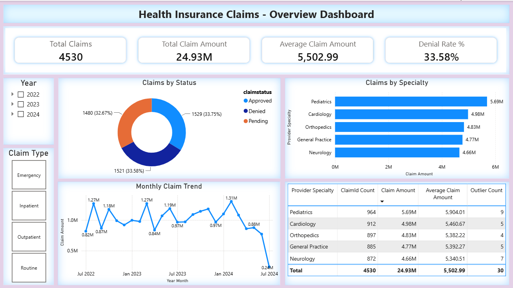
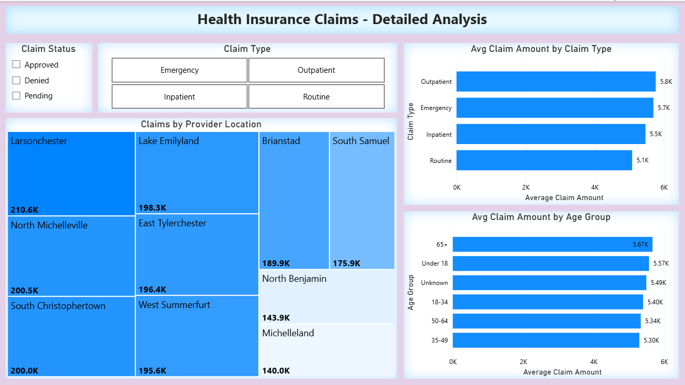

# Healthcare Insurance Claims Analysis

I built this project to showcase my upskilling in Python and Power BI, coming from a healthcare insurance background where I worked with claims data professionally using SQL and Excel.

The project follows the full analytics workflow from raw CSV data through cleaning, SQL analysis, and dashboard reporting in Power BI.

---

## Dashboard Preview

### Overview Dashboard

### Detailed Analysis

---

## Tools Used

Python, Pandas, Matplotlib, SQL Server, SQLAlchemy, Power BI, Jupyter, SSMS, GitHub

---

## Dataset

[Enhanced Health Insurance Claims - Kaggle](https://www.kaggle.com/datasets/leandrenash/enhanced-health-insurance-claims-dataset)
4,500 records, 17 columns

---

## What This Project Covers

- Data quality simulation and cleaning (nulls, duplicates, inconsistent values)
- Exploratory analysis and anomaly detection using IQR
- ETL pipeline loading cleaned data into SQL Server
- 6 SQL queries using CTEs, window functions, and CASE WHEN
- 2-page interactive Power BI dashboard connected to SQL Server

---

## Project Structure
- `healthcare_claims_analysis.ipynb` - Main analysis notebook
- `sql/` - 6 SQL query scripts
- `data/` - Cleaned claims dataset
- `dashboard_overview.png` - Power BI overview page
- `dashboard_detailed.png` - Power BI detailed analysis page

---

## Key Findings

- Claim distribution roughly 33% each across Approved, Denied and Pending
- Pediatrics has highest volume and average claim amount at 5,790 per claim
- Outpatient claims averaged higher than Emergency - 5.8K vs 5.7K
- Patients aged 65+ have highest average claim at 5.67K
- 30 outlier records flagged (0.66%) - high-cost claims and billing reversals
- 45 records with PatientAge = 0 found in source data and flagged for investigation

---

## How to Run

1. Clone this repo
2. Run: `pip install pandas matplotlib sqlalchemy pyodbc jupyter`
3. Download dataset from Kaggle link above
4. Open `healthcare_claims_analysis.ipynb` and run all cells
5. Update server name in Step 12 with your SQL Server instance

---

## About

I previously worked as a data analyst handling healthcare insurance claims, ETL pipelines, SQL based premium calculations, and month-over-month analysis. In that role everything was SQL and Excel with no visualization layer.

This project reflects the same workflows but built with Python and Power BI and showed me how much easier it is to communicate findings visually compared to sharing SQL query outputs.
